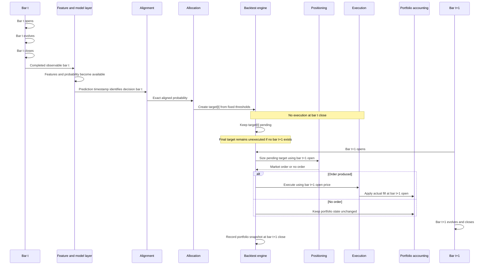
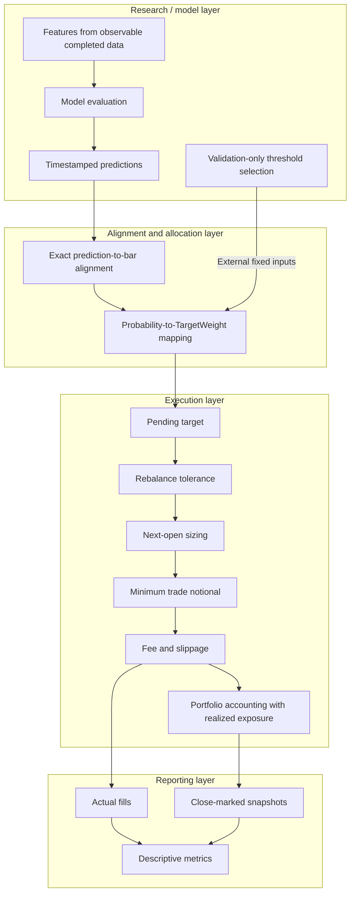

# Execution-Aware Backtest

Execution-Aware Backtest is a portfolio-level execution simulation prototype. The project currently provides strict synthetic OHLCV loading, a deterministic baseline target rule, price-free CASH/LONG target intents, a minimal deterministic next-bar execution loop, quantity-based fills, immutable single-asset long/cash accounting, and a separate deterministic reporting layer. It is not a production backtester.

The planned timing convention is to generate signals at a bar close and permit execution only at the next bar open. Same-bar close execution and execution of final-bar signals are non-goals.

## Setup

Python 3.11 or newer is required. From the repository root, use the existing virtual environment:

```powershell
.\.venv\Scripts\python.exe -m pip install -e ".[test]"
.\.venv\Scripts\python.exe -c "import backtest; print(backtest.__version__)"
.\.venv\Scripts\python.exe -m pytest -q
```

## Repository structure

- `src/backtest/`: strict OHLCV loading, target-to-order conversion, a minimal bar loop, fill mathematics, and portfolio state transitions
- `tests/fixtures/`: deterministic synthetic test data
- `config/`: future scenario configuration
- `data/raw/`, `data/processed/`, `data/metadata/`: future local data organization
- `notebooks/`: optional exploration, not source-of-truth logic
- `scripts/`: future task-specific scripts
- `results/`: future generated results
- `artifacts/codex_review/`: ignored local review evidence

`tests/fixtures/simple_bars.csv` is synthetic and does not reproduce real market data.

Stage 6A freezes a separate real-market data prerequisite before any rule-based results are inspected: Binance Public Data Spot `BTCUSDT` hourly bars from `2024-01-01T00:00:00Z` through `2024-12-31T23:00:00Z` (8,784 rows, timestamps denoting bar opens). `scripts/prepare_binance_snapshot.py` downloads only the twelve specified monthly archives, preserves and hashes them, converts their existing order to the project OHLCV schema, and validates the result through the production loader without sorting, filling, interpolation, deduplication, or repair. This snapshot is designated for the future rule-based demonstration and is not eligible as an untouched future ML final-test period; Stage 6A runs no strategy or backtest and inspects no performance result.

Stage 6 runs the fixed previous-close fractional rule on that frozen real-market hourly snapshot using completed closes only and next-bar-open execution, with fee and slippage assumptions fixed in advance. Execution-aligned buy-and-hold and zero-position baselines use the same engine and costs. Formal outputs preserve metadata, target timing, actual fills, realized portfolio history, and descriptive summaries. No parameter is tuned from observed performance; the inspected period is not an untouched future ML final test, and the results do not establish alpha, momentum validity, robust profitability, or production readiness.

Stage 7 defines a strict model-agnostic loader for immutable prediction CSV artifacts. Each prediction row contains a completed decision-bar timestamp, symbol, probability, model ID, and period label; separate metadata records the exact file checksum, model and data identifiers, period bounds, row count, and generation information. Predictions must align one-to-one with completed bars, with no timestamp shifting, sorting, filling, interpolation, clipping, deduplication, or nearest matching. Loading probabilities remains separate from allocation mapping and backtest execution. No real ML artifact has been integrated, and this schema stage validates neither a model nor a signal. Final-test predictions must remain frozen and must not participate in policy, threshold, feature, model, parameter, cap, or mapping selection.

Stage 8 defines a strict machine-readable pre-registration schema for the existing predefined continuous linear long-only allocation policy, without executing that mapping. No probability threshold is used. The specification freezes full permitted exposure, costs, rebalance controls, next-bar timing, execution-aligned buy-and-hold and zero-position baselines, expected output schemas, and prohibitions on performance-based policy changes. A complete freeze must identify and reconcile one immutable prediction artifact. No real ML prediction artifact currently exists here, so final Stage 9 eligibility has not been established; Stage 8 runs no model and no backtest. After final-result inspection, a changed policy requires a new experiment identity and explicit non-final diagnostic status and cannot replace the frozen final result.

## Project workflow

```mermaid
flowchart LR
    Bars[Chronological hourly OHLCV bars]
    Predictions[Timestamped precomputed probabilities]
    Alignment[Prediction timestamp alignment]
    Allocation[Probability allocation policy]
    Target[TargetWeight]
    Engine[Next-bar backtest engine]
    Pending[Pending target]
    Positioning[Next-bar-open positioning]
    Order{Order or no order}
    Execution[Market-order execution]
    Fill[Actual fill]
    Portfolio[Portfolio accounting]
    NoTrade[No order]
    Snapshots[Close-marked portfolio snapshots]
    Reporting[Descriptive reporting]
    TradeLog[Trade log and descriptive metrics]

    Bars --> Alignment
    Predictions --> Alignment
    Alignment -->|Aligned probabilities| Allocation
    Allocation --> Target
    Bars --> Engine
    Target --> Engine
    Engine --> Pending
    Pending --> Positioning
    Engine -->|Observable next open| Positioning
    Positioning --> Order
    Order -->|Order| Execution
    Order -->|No order| NoTrade
    Execution --> Fill
    Fill --> Portfolio
    NoTrade -->|State unchanged| Portfolio
    Portfolio --> Snapshots
    Fill --> Reporting
    Snapshots --> Reporting
    Reporting --> TradeLog
```



## Timing semantics



## Responsibility boundaries

Model evaluation, validation-only threshold selection, allocation mapping, execution filtering, and reporting are separate responsibilities. Final test data does not participate in threshold selection.



These diagrams describe workflow and timing contracts only; they do not establish model validity, absence of feature leakage, or trading profitability.

## Data validation

`backtest.data.load_bars_csv` preserves CSV row order and returns immutable bars with UTC-aware timestamps and floating-point OHLCV values. It rejects malformed schemas, invalid OHLCV values, non-chronological or duplicate timestamps, and timestamps that are not exactly one hour apart. Missing bars are rejected rather than sorted, forward-filled, inferred, or repaired.

## Execution mathematics

Quantity-based market orders are represented by immutable records. `backtest.execution.execute_market_order` deterministically calculates a fill from a supplied next-bar open reference price. Directional slippage and proportional fees are retained separately: buys receive a higher fill price and negative cash flow, while sells receive a lower fill price and positive cash flow. The function does not choose orders, enforce bar timing, or read or update portfolio cash and positions.

## Target positioning

`backtest.positioning.PendingTarget` represents an already-determined CASH or LONG target independently from any model output. It is created after a completed decision bar and stores only that bar's timestamp and the target; it contains no future price or quantity. `market_order_for_target_at_open` converts the intent into a quantity-based market order, or `None`, only when the next execution-bar open is observable. All-in buy affordability includes adverse directional slippage and the proportional fee. If floating-point evaluation leaves a machine-precision cash excess, quantity is conservatively adjusted downward by a small bounded number of float steps until the strict affordability invariant is satisfied. Repeated CASH or LONG targets produce no trade, and an existing long position is not rebalanced. The positioning layer itself contains no model, threshold, strategy, fill execution, or portfolio mutation.

The positioning layer also defines immutable single-asset `TargetWeight` values constrained to `[0.0, 1.0]`: `0.0` represents fully cash, `1.0` represents fully long, and intermediate values represent intended partial long exposure. `PendingTargetWeight` retains a price-free continuous target until the execution-bar open is observable. `market_order_for_target_weight_at_open` then values the existing position and the pre-trade portfolio at that open and can return a partial BUY or SELL delta order. It does not execute the order, create a fill, or mutate the portfolio; the existing execution and portfolio layers remain responsible for fills and account changes.

Continuous target-weight sizing retains the pre-trade reference-open allocation definition and calculates ideal exposure quantity from that open. For BUY orders, adverse slippage and the proportional fee are included in the effective unit cash cost used to cap quantity to affordability. SELL quantity remains the reference-open exposure difference, capped by the existing position. The execution and portfolio layers still determine actual fills, fees, cash flows, and account changes.

Because transaction costs reduce portfolio value, realized post-cost weight may differ from the intended target; no implicit post-cost exact-target solver is used. Exact target matching is retained only when both rates are zero.
Existing binary TargetPosition conversion and engine behavior remain unchanged, and fractional weights are never silently coerced into that binary path.

Continuous positioning also accepts an explicit absolute rebalance tolerance. Current weight is calculated from pre-trade portfolio value marked at the execution open, and no order is generated when the absolute current-to-target deviation is less than or equal to the tolerance. A triggered order still sizes toward the exact intended target; the tolerance does not change fee, slippage, affordability, or SELL sizing. A zero tolerance retains the prior exact-match-only behavior.

After tolerance and final cost-aware quantity sizing, continuous positioning applies a required non-negative minimum expected trade notional. BUY expected notional uses the adverse slipped BUY price, while SELL expected notional uses the adverse slipped SELL price. Fees and cash flow are excluded. Expected notional below the minimum is suppressed; equality is allowed, and a zero minimum retains prior behavior. Skipped orders are not accumulated. No post-cost exact-target solver is implemented, and binary behavior remains unchanged.

## Deterministic baseline strategy

`backtest.strategy.previous_close_momentum_targets` is a minimal one-bar close-momentum baseline used to validate the strategy-to-execution boundary. Its first completed bar maps to CASH. Each later completed bar maps to LONG only when its close is higher than the preceding close; a flat or falling close maps to CASH. Targets are created only after their bars complete and can execute only at the next bar open through the existing engine. Allocation remains binary fully invested long or cash.

`backtest.strategy.previous_close_momentum_target_weights` is the deterministic fractional counterpart. Its first completed bar maps to weight `0.0`; a later rising close maps to `0.75`, a flat close to `0.50`, and a falling close to `0.25`. It compares only the current and immediately preceding completed closes and returns precomputed immutable target weights. It does not inspect portfolio state, costs, tolerance, or minimum notional and does not execute orders. Execution remains the separate fractional engine's responsibility.

These fixed rules have no probability mapping, threshold selection, parameter fitting, or optimization. They are workflow baselines, not evidence of alpha, benchmark superiority, robust profitability, or an optimized allocation policy.

## Probability allocation policy

`backtest.allocation.probabilities_to_target_weights` converts already-generated probabilities into immutable `TargetWeight` values using a fixed three-region rule. Probabilities below the required lower threshold map to `0.0`, probabilities from the lower threshold through the upper threshold inclusive map to `0.5`, and probabilities above the upper threshold map to `1.0`. Input order is preserved, and the policy neither rounds nor clips values.

`backtest.allocation.probabilities_to_continuous_target_weights` provides a separate predefined deterministic long-only mapping: `weight = min(1.0, max(0.0, 2.0 * probability - 1.0))`. It returns intended weights in `[0.0, 1.0]` and is not fitted, optimized, or economically validated; model probability is not assumed to equal optimal capital allocation. This stage implements mapping only and has not added the policy to a comparison experiment.

The continuous mapping is validated through a deterministic synthetic correctness workflow covering exact timestamp alignment, continuous `TargetWeight` mapping, next-bar execution, partial rebalancing, portfolio accounting, and descriptive reporting. Its single cost-aware scenario is an integration diagnostic, not a cost-sensitivity study. This is neither a policy-comparison experiment nor a real-market evaluation, and it provides no evidence of profitability.

Binary, three-state, and continuous policies are also compared on the same fixed synthetic probabilities and constant-price bars to isolate mapping and rebalance mechanics. The deterministic comparison reports target transitions, actual fills, turnover, and realized exposure for every predefined diagnostic policy. It selects no winner, treats neither more trades nor higher turnover as better, and is not a real-market evaluation or profitability test.

Four fixed cost scenarios—zero cost, fee only, slippage only, and fee plus slippage—are applied to the same synthetic bars, probabilities, continuous targets, and execution controls. The comparison holds allocation intent fixed while examining actual fill prices, quantities, fees, turnover, exposure, drawdown, and portfolio paths. Scenario-level return differences are descriptive and path-dependent, not exact transaction-cost attribution; no scenario is optimized or selected, and this remains a synthetic diagnostic rather than a real-market evaluation or profitability claim.

Three predefined maximum target-weight caps (`1.00`, `0.50`, and `0.25`) are applied to the same continuous target sequence while bars, probabilities, costs, and execution controls remain fixed. The synthetic diagnostic compares intended targets with actual exposure, turnover, fees, return, and drawdown. Lower drawdown under a lower cap may simply reflect lower realized exposure; no cap is optimized, ranked, or selected, and the comparison is not evidence of improved risk-adjusted performance or profitability.

Threshold values are inputs to the policy and must be selected outside this module using training/validation data only. Final test data must not participate in threshold selection. The module does not fit or select thresholds and adds no model inference, model training, feature or probability generation, threshold optimization, or alpha claim.

Allocation thresholds convert probabilities into intended target weights. They are separate from rebalance tolerance, which decides whether realized weight is close enough to an intended target to avoid a trade, and minimum trade notional, which can suppress an already-sized order. The allocation module does not inspect bars, timestamps, portfolio state, costs, execution controls, orders, fills, or reporting. Synthetic targets produced by the policy pass directly to the existing fractional engine and reporting, where actual fills and realized snapshots remain the source of reported outcomes.

## Prediction timestamp alignment

`backtest.prediction_alignment.align_probabilities_to_bars` validates already-generated timestamped probabilities against completed chronological bars. Repository bar timestamps identify bar opens, and a prediction timestamp identifies that same decision bar: after UTC normalization, prediction `i` must exactly match `bars[i].timestamp`. Alignment is one-to-one and index-preserving. It does not sort, shift, fill, interpolate, drop, deduplicate, or nearest-match observations, and source timestamps are not mutated.

The prediction timestamp is not an execution timestamp. After alignment and separate allocation, the resulting target for bar `t` remains eligible for execution only at the next bar open through the existing engine. The alignment module does not inspect models, features, labels, thresholds, train/validation/test splits, portfolio state, costs, or execution. Synthetic integration validates timestamp and engine compatibility only; successful alignment does not prove feature-level absence of look-ahead or leakage and adds no model inference, threshold selection, or alpha claim.

## Minimal engine

`backtest.engine.run_backtest` consumes one precomputed CASH or LONG target for each completed chronological bar. A target created from bar `t` can execute only at bar `t+1` open; the final bar's target is retained as unexecuted because no later open exists. The engine delegates target conversion, fill calculation, and portfolio accounting to their existing modules, records real fills only, and stores one immutable end-of-bar portfolio snapshot per bar. Portfolio value is marked as cash plus long quantity times that bar's close and is only a state observation, not a performance conclusion. The loop does not perform prediction, threshold selection, strategy generation, performance analysis, or output generation.

`backtest.engine.run_target_weight_backtest` is a separate explicit workflow for precomputed continuous `TargetWeight` values, with exactly one target supplied per bar. It preserves the same close-decision to next-open timing: the first bar cannot execute its own target, target `t` may execute only at bar `t+1` open, and the final target remains unexecuted. Cost-aware sizing, rebalance tolerance, and minimum-notional filtering remain delegated to positioning. Only actual fills are recorded, and each snapshot is marked at the current bar close after any current-open execution. Binary engine behavior remains unchanged. No post-cost exact-target solver or multi-asset workflow is implemented.

## Portfolio accounting

`backtest.portfolio.apply_fill` returns a new immutable single-asset portfolio state after applying a fill to cash, long position quantity, and cumulative fees. It rejects insufficient cash and insufficient long position; leverage, margin, and short selling are not supported. Fill prices, fees, and slippage are accepted from the execution layer rather than recalculated.

## Deterministic reporting

`backtest.reporting` consumes an already completed immutable binary `BacktestResult` or continuous `TargetWeightBacktestResult`; it does not modify the result or add calculations to the engine. Both result types use the same immutable normalized trade-log records copied from actual fills and the same descriptive whole-period summary metrics: cumulative return, signed maximum drawdown, absolute gross fill-notional turnover, average end-of-bar long capital exposure, fees incurred during the run, and buy, sell, and total fill counts. Suppressed targets create no records or fees, and the final unexecuted target does not affect metrics.

Initial portfolio value marks initial cash and quantity using the first snapshot close; final value uses the last stored snapshot value. Turnover is normalized by the initial marked value and is not annualized or average daily turnover. Exposure is the arithmetic mean of actual close-marked portfolio holdings, not intended target weights or an intrabar measure; fractional exposures therefore arise naturally from realized positions. No Sharpe ratio or annualization is included, and no benchmark or alpha conclusion is made. These diagnostics are descriptive and are not evidence of robust profitability.

## Not implemented

## Not implemented

Model training or inference, learned or optimized prediction-to-target policies, threshold-selection workflows, general-purpose strategy configuration, multi-asset execution, short selling, leverage, order-book simulation, market impact, partial fills, live market-data ingestion, and production trading are not implemented.

The repository includes task-specific data-preparation and demonstration scripts with deterministic CSV outputs, but it does not provide a general-purpose backtesting CLI or configuration framework.
