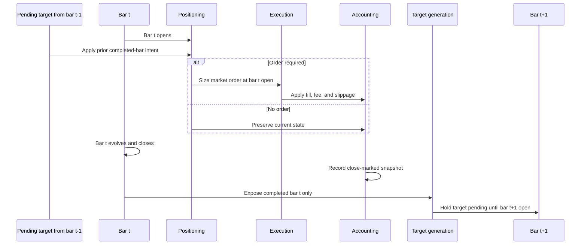

# Execution-Aware Backtest

Execution-Aware Backtest is a deterministic, single-asset, bar-based backtest
prototype focused on execution timing, transaction costs, portfolio accounting,
reproducibility, and descriptive diagnostics. Signals and target intents are
formed only from completed bars and may execute only at the next bar open. It is
not a production backtester, a validated alpha strategy, or a production
trading system.

## Design goals

- Put correctness before complexity.
- Keep behavior deterministic and hand-checkable.
- Process bars strictly chronologically without future-data access.
- Separate decision, allocation, positioning, execution, accounting, and
  reporting responsibilities.
- Preserve reproducible input provenance and formal CSV outputs.
- Retain and interpret negative results conservatively.

## Core timing contract

For each bar `t`, the engine processes events in this order:

```text
bar t opens
-> pending target from bar t-1 executes at the observable open, if needed
-> bar t evolves and closes
-> the portfolio is marked at the close and its snapshot is recorded
-> a target for bar t is formed from completed observable data
-> that target waits for bar t+1 open
```

There is no same-bar close execution and no future-bar access. A target formed
from the final bar remains unexecuted because no later open exists. A prediction
timestamp identifies its completed decision bar, not its execution bar.



## Implemented functionality

### Data

- Strict hourly OHLCV CSV loading with UTC-aware bar-open timestamps.
- Chronological ordering and exact one-hour interval validation.
- Rejection of malformed values, duplicate timestamps, missing intervals, and
  invalid OHLCV rows.
- No silent sorting, filling, interpolation, deduplication, or repair.

### Targets and positioning

- Separate binary `CASH`/`LONG` and continuous `TargetWeight` paths.
- Continuous long-only target weights constrained to `[0.0, 1.0]`.
- Next-open sizing, partial rebalancing, absolute rebalance tolerance, and a
  minimum expected trade-notional filter.
- Explicit rejection of silent binary/fractional coercion.

### Execution and accounting

- Deterministic quantity-based market-order fills.
- Adverse directional slippage and proportional fees recorded separately.
- Cost-aware BUY affordability and position-capped SELL sizing.
- Immutable cash, asset quantity, and cumulative-fee state transitions.
- Long-only accounting with no leverage or short selling.

### Reporting

- Formal trade logs and close-marked portfolio histories.
- Final portfolio value, cumulative return, signed maximum drawdown, turnover,
  average realized exposure, total fees, and buy/sell/total fill counts.
- Exposure derived from actual close-marked holdings, not intended target
  weights.

### Reproducible interfaces

- Frozen market-data metadata and SHA-256 checksums.
- A strict prediction-artifact schema and loader.
- Exact, one-to-one, index-preserving prediction-to-bar alignment.
- An immutable predefined policy-freeze schema.
- Complete prediction and policy reconciliation required before any optional
  future ML execution integration.

## Validation layers

### Layer A - Synthetic correctness

Deterministic synthetic tests and workflows validate next-bar timing, partial
rebalancing, fee and slippage mathematics, BUY affordability, immutable
accounting, final-target behavior, and reporting reconciliation. They also
exercise binary, three-state, and continuous allocation mechanics, plus fixed
synthetic cost and maximum-target-weight diagnostics. These controlled cases
establish mechanical correctness; they do not establish market profitability.

### Layer B - Rule-based real-market execution demonstration

The primary real-market demonstration uses 8,784 Binance Spot `BTCUSDT` hourly
bars from `2024-01-01T00:00:00Z` through `2024-12-31T23:00:00Z`. Its fixed
previous-close fractional rule maps:

- the first completed bar to `0.00`;
- a rising close to `0.75`;
- an unchanged close to `0.50`;
- a falling close to `0.25`.

The rule was fixed before full-result inspection and used no parameter search.
Targets execute at the next bar open under fixed fee and slippage assumptions.
Execution-aligned buy-and-hold and zero-position baselines use the same engine.
This layer demonstrates execution behavior on a real price path, not validated
signal evidence.

### Layer C - Optional frozen ML integration

The prediction-artifact and allocation-policy-freeze interfaces are
implemented, but real ML execution integration is deliberately deferred. The
existing BTC/ETH signal-validation workflow produces daily outputs, while this
repository's execution contract is hourly. Daily predictions are not
forward-filled, duplicated, interpolated, nearest-matched, shifted, or
relabeled. A genuine frozen hourly prediction artifact must first be generated
by the separate ML repository; this repository will consume only immutable
predictions. See the
[ML integration compatibility decision](data/metadata/ml_integration_compatibility_decision.md).

## Formal real-market results

The following table presents the existing cost-inclusive Stage 6 summary with
readable display precision. The formal CSV retains the underlying values.

| Policy | Final value | Cumulative return | Maximum drawdown | Turnover | Average realized exposure | Total fees | Trades |
| --- | ---: | ---: | ---: | ---: | ---: | ---: | ---: |
| Previous-close fractional rule | 31.81 | -96.82% | -96.91% | 689.13 | 50.58% | 689.13 | 8,782 |
| Execution-aligned buy-and-hold | 2,192.63 | +119.26% | -32.31% | 1.00 | 99.98% | 1.00 | 1 |
| Zero-position | 1,000.00 | 0.00% | 0.00% | 0.00 | 0.00% | 0.00 | 0 |

Initial cash was `1000.0`, the fixed fee rate was `0.001`, and the fixed
slippage rate was `0.0005`. This was one cost-inclusive scenario. The fractional
rule performed poorly, and the results do not support a profitability or alpha
claim. No policy was selected from the results; buy-and-hold is a benchmark,
not a chosen winner. The complete interpretation and full-precision values are
in the [final descriptive evaluation](docs/final_descriptive_evaluation.md).

## Reproducibility

Python 3.11 or newer is required. From the repository root:

```powershell
.\.venv\Scripts\python.exe -m pip install -e ".[test]"
.\.venv\Scripts\python.exe -m pytest -q
```

The frozen data-preparation interface accepts the exact raw, processed, and
metadata destinations:

```powershell
.\.venv\Scripts\python.exe scripts\prepare_binance_snapshot.py `
  --raw-dir data\raw\BTCUSDT_1h_2024 `
  --processed-output data\processed\BTCUSDT_1h_2024.csv `
  --metadata-output data\metadata\BTCUSDT_1h_2024_metadata.csv
```

That command downloads the twelve fixed Binance monthly archives. The existing
Stage 6 runner command is:

```powershell
.\.venv\Scripts\python.exe scripts\run_rule_based_real_market_demo.py `
  --input data\processed\BTCUSDT_1h_2024.csv `
  --output-dir results\rule_based_real_market_demo `
  --symbol BTCUSDT
```

The processed input is `data/processed/BTCUSDT_1h_2024.csv` with SHA-256:

```text
31e4ae5ef79de2b3e8546fb21bef57300e0a43c4cabab10bfd81e53803fc9db9
```

Provenance is recorded in
[`BTCUSDT_1h_2024_metadata.csv`](data/metadata/BTCUSDT_1h_2024_metadata.csv)
and
[`BTCUSDT_1h_2024_snapshot_spec.csv`](data/metadata/BTCUSDT_1h_2024_snapshot_spec.csv).
Formal results are under `results/rule_based_real_market_demo/`:

- `summary.csv`
- `trades.csv`
- `portfolio_history.csv`
- `targets.csv`
- `metadata.csv`

The full Stage 11 verification suite contains 1,099 passing tests. The Stage 6
run is reproducible from the frozen local snapshot, but the processed
market-data CSV is ignored by Git, so a repository checkout alone is not fully
self-contained.

## Repository structure

- `src/backtest/`: core data, allocation, positioning, execution,
  accounting, alignment, policy-specification, engine, and reporting logic
- `tests/`: deterministic unit, integration, workflow, and regression tests
- `scripts/`: task-specific snapshot preparation and real-market demonstration
  runners
- `data/metadata/`: frozen provenance, checksum, timestamp, prediction, policy,
  and compatibility records
- `results/`: generated formal Stage 6 result CSVs
- `docs/`: research interpretation and portfolio presentation
- `artifacts/codex_review/`: ignored local review evidence

## Limitations and non-goals

- Single asset, single venue, and hourly bars only.
- Long-only execution with no short selling or leverage.
- No order book, market impact, or partial-fill model.
- Fixed proportional fee and slippage scenarios only.
- No advanced latency model beyond completed-bar decisions and next-bar-open
  execution.
- No statistical inference or general-purpose strategy configuration framework.
- No real ML integration yet and no claim that exact timestamp alignment proves
  upstream feature-level absence of leakage.
- No production-readiness or broad profitability conclusion.
- The 2024 demonstration period must not be reused as an untouched future ML
  final test.

## Documentation

- [Final descriptive evaluation](docs/final_descriptive_evaluation.md)
- [Portfolio and interview narrative](docs/portfolio_narrative.md)
- [ML integration compatibility decision](data/metadata/ml_integration_compatibility_decision.md)
- [Prediction artifact schema](data/metadata/prediction_artifact_schema.md)
- [Allocation policy specification schema](data/metadata/allocation_policy_spec_schema.md)
